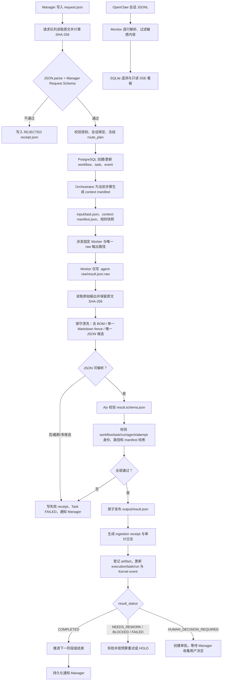

```mermaid
flowchart TD
  A[Manager 写入 request.json] --> B[请求队列读取原文并计算 SHA-256]
  B --> C{JSON.parse + Manager Request Schema}
  C -- 不通过 --> CR[写入 REJECTED receipt.json]
  C -- 通过 --> D[校验授权、会话绑定、冻结 route_plan]
  D --> E[PostgreSQL 创建/更新 workflow、task、event]

  E --> F[Orchestrator 为当前步骤生成 context manifest]
  F --> G[input/task.json、context-manifest.json、规则快照]
  G --> H[派发固定 Worker 与唯一 raw 输出路径]
  H --> I[Worker 仅写 .agent-raw/result.json.raw]

  I --> J[读取原始输出并保留原文 SHA-256]
  J --> K[保守清洗：去 BOM / 单一 Markdown fence / 唯一 JSON 候选]
  K --> L{JSON 可解析？}
  L -- 否/截断/多候选 --> LF[写失败 receipt，Task FAILED，通知 Manager]
  L -- 是 --> M[Ajv 校验 result.schema.json]
  M --> N[校验 workflow/task/run/agent/attempt 身份、路径和 manifest 哈希]
  N --> O{全部通过？}
  O -- 否 --> LF
  O -- 是 --> P[原子发布 output/result.json]
  P --> Q[生成 ingestion receipt 与审计日志]
  Q --> R[登记 artifact，更新 execution/task/run 与 Kernel event]
  R --> S{result_status}
  S -- COMPLETED --> T[推进下一阶段或结束]
  S -- NEEDS_REWORK / BLOCKED / FAILED --> U[失败并按预算重试或 HOLD]
  S -- HUMAN_DECISION_REQUIRED --> V[创建审批，等待 Manager 收集用户决定]
  T --> W[持久化通知 Manager]

  X[OpenClaw 会话 JSONL] --> Y[Monitor 逐行解析、过滤敏感内容]
  Y --> Z[SQLite 遥测与只读 SSE 看板]
```