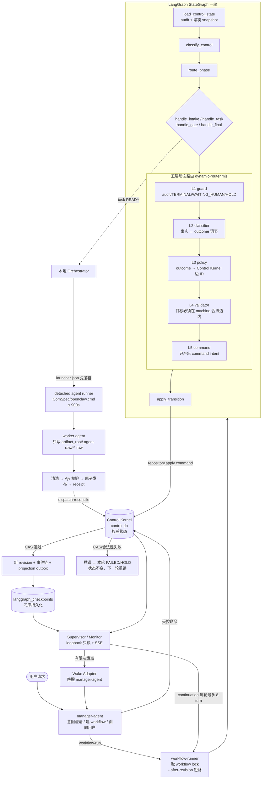

# 第三周总结（2026-08-06 → 2026-08-12）

> 覆盖范围：58 个 commit，303 个文件，+16035 / −9277。
> 报告基准：分支 `codex/lite-stategraph-supervisor`，HEAD `980fb8f`（2026-08-12）。
> 依据：`CHANGELOG.md` 对应条目 + `git log --since=2026-08-05`。

---

## 1. 本轮主线

从「Manager（LLM）驱动流程」收敛到「固定代码驱动流程」：

1. 先把系统变成**可观测**的（Monitor / Supervisor）；
2. 再把派发权和结果通路从 Agent 手里**收回本地 Orchestrator**；
3. 再用 StateGraph 把路由决策变成**确定性、可审计**的流水线，并把合法边收进 Control Kernel；
4. 再压 Manager 的 **token 成本**，并修掉 Windows 上会留下不可恢复 `RUNNING` 的派发缺陷；
5. 最后加**持久 checkpoint**，让 Supervisor 自己续跑，只在有限决策点唤醒 Manager。

全程一条没松的红线：**任何情况下都不伪造 completion、不伪造审批、不跳过 Gate。**

---

## 2. 五波变更

### 第一波（08-06）：Monitor / Supervisor 从 0 建起，Phase 0–9

| Phase | 提交 | 内容 |
| --- | --- | --- |
| 0–2 | `cdc4ba6`、`8b60df7`、`d972e54` | ADR 与基线；把 Control Kernel 监督事实抽成只读快照；宿主机原生 Supervisor Core + HTTP API + SSE |
| 3 | `f1a5fac` | activity 遥测库、脱敏、兜底采集 |
| 4 | `70e7380`（计划 `3ca58a2`/`e4ae90a`） | 放弃前端工程，改为可直接打开的静态 HTML 看板：13 阶段轨道、task/session 卡片、SSE live feed |
| 5 | `ebd55dc` | 多证据 Health Classifier + Watchdog **shadow 模式**；明确「lease 过期 ≠ LOST」，长工具调用有独立宽限窗口 |
| 6 | `59481f0` | Watchdog 非 shadow 走 request/outbox/receipt 闭环；新增**默认关闭**的 Manager Wake Adapter，只唤醒唯一编排者 |
| 7 | `69d5d1b` | `task-retry` 边界：只有已确认终态的 FAILED/LOST dispatch 才能开新 attempt，禁止复用 artifact 路径；看板加人工请求，但网页请求本身不改控制状态 |
| 8–9 | `7571900`、`2ad269e`、`1177edc` | 遥测保留策略、启动脚本、100 workflow 性能基线；端口 `4310 → 4319`（本机 4310 被 QQ 占用，是此前 `Failed to fetch` 的真因）；`/api/client-config` 实现零输入连接 |

### 第二波（08-07）：收紧本地编排边界 + 重装 + Linux 部署

- **P0/P1（`2e77ae7`、`4099f50`）** —— 本波核心：
  - 新增本地 `orchestrator`：dispatch / session / receipt / completion / retry 全部从 Control DB 已验证 task 派生，**Agent 不再决定派发和状态写入**；
  - 确立唯一结果通路 `.agent-raw → 本地清洗 → Ajv → 原子发布 → ingestion receipt`；
  - Monitor 删除所有公共写入/交互入口，只输出阶段、状态、负责 Agent、健康和用户可见对话；
  - 失败自动写 `.orchestrator-ingest/*.failure.json` + `validation-errors.jsonl`（只留 hash 与脱敏摘要）。
- **Agent reinstall 硬化（`432be56`）**：从混入诊断行的 OpenClaw stdout 中提取合法 JSON；对配置版本冲突、文件锁超时、stale revision 做有界退避重试；重装固定为备份 → 删除 → 确认 → 清理 → 重装 → 校验，失败即回滚。
- **Tomcat HTTPS 部署（`6400f3e`、`3119f4e`）**：GET-only Proxy Servlet，只代理回环 `127.0.0.1:4319/api`，不转发 Origin / Cookie / Authorization；`fast-uri` 升到 3.1.5 消除高危审计项。

### 第三波（08-10）：引入 LangGraph StateGraph 编排层 + V2 收口

- **有界 runner（`8bba39c`、`909a2e7`）**：引入 `@langchain/langgraph`，一轮只推进一个稳定动作；`WAITING_HUMAN` / `HOLD` / 运行中 task / 终态立即返回；新增阶段策略配置与 Graph run result Schema。
- **五层动态路由（`ec66dee`、`d39d338`、`ee7c336`）**：安全守卫 → 结果分类 → 阶段策略 → 状态机合法边校验 → command 构建；`route_kind` / `route_reason` / `route_facts` 落盘可审计。边界是「五层只是单轮内存流水线，最后只产出 command intent」。
- **合法边收敛到 Control Kernel（`ef850ce`）**：`workflow-graph-v1.json` 移除全部阶段目标名，Graph 只引用具名边 ID（`STANDARD_FLOW` / `PASS` / `NEEDS_REWORK`），不再靠数组顺序隐式选目标；Gate 结果新增 `failure_target`，`overall=FAIL` 必填且必须是当前 Gate 的合法边。
- **V2 收口（`8285671`）**：统一 `condition=WAITING_HUMAN`；`runtime-guard.mjs` 收敛为纯 v2 产物校验入口；删除 v1 Schema、迁移脚本与 `unsafe-direct-writes/`；旧文档移入 `docs/archive/legacy/`；明确不迁移历史数据、不改写 `control.db`。
- **JSON 契约矩阵（`dc9d912`、`2a15100`、`7b2b677`）** 与跨平台修复（`ab89040`、`ee737c8`）。

### 第四波（08-11）：Manager token 成本优化 + Windows 派发恢复

- **紧凑上下文四连**（`dcc3cc9`、`4f91a48`、`4b06d27`、`3146758`）：
  - `snapshot --view manager`：只给当前状态、活动 task、待审批、待处理 dispatch、最新事件；
  - `workflow-run --after-revision`：无更新 revision 直接 `WAITING_FOR_CHANGE`，不白跑一轮；Schema validator 进程内复用；
  - **静态 Flash/Pro 分级**：Requirement / Test / Release / Dialogue 用 `deepseek-v4-flash`，Manager / Architect / Developer / Review 保留 `deepseek-v4-pro`，明确本轮不做动态选模；
  - 软预算 80%/160k → **60%/120k**，thinking high → medium；新增 `manager-context` 命令，把预算判断与紧凑快照合并成一次确定性读取（`MEASURE_CONTEXT` / `START_NEW_MANAGER_SESSION` / `CONTINUE`）。
- **Windows 派发恢复**：不再用 Node `shell:true`，改为显式 `ComSpec` + `/d /s /c` + `windowsVerbatimArguments` 调 `openclaw.cmd`；`dispatch` 非阻塞立即返回 `STARTED`，新增 `dispatch-reconcile --dispatch-id` 单独对账；launcher locator 在 Control Kernel 事务**之前**落盘。历史上无 launcher 证据的 dispatch 只返回 `RECOVERY_REQUIRED`，**不凭聊天记录或残留文件伪造 completion**。同时给 Manager 加应急恢复边界与 `summary_only` 可见输出约束。
- `4ee6c78` / `572543f`：Todo App、Chat Demo 初始配置与跑通的 Todolist 单页应用产物。

### 第五波（08-12）：轻量 StateGraph + 持久 Supervisor + 会话控制台

- **`d0c4563`**：新增 `scripts/orchestrator/sqlite-checkpointer.mjs`（`langgraph_checkpoints` / `langgraph_checkpoint_writes` 两张表建在 `control.db` 内），Graph 以 `thread_id = workflowId` 持久化 checkpoint。**这否掉了 08-10「不启用独立 checkpointer」的决定。**
- **`7bd704e`**：Agent 执行超时、dispatch lease、工具宽限、JSON 契约调用上限统一抬到 **900 秒**，> 901 秒 fail-closed；Manager 唤醒与健康检测保持各自短上限（wake 仍 ≤ 300s）。新增 `scripts/agent-json-harness/timeout-policy.mjs` 与 `config/agent-execution-policy.json` 作为单一来源。
- **`40d429c`**：Supervisor 从 durable checkpoint 续跑 —— `workflow-continuation.mjs` 先对账有 `process-result.json` 的 pending dispatch，再对每个非终态 workflow 跑最多 8 轮 Graph，**只在有限决策点唤醒 Manager**。
- **`e199c84` + `ae63dbd` + `2641b75`**：新增 `monitor/session-catalog.mjs` 与全 Agent / session 索引 / 安全对话 API；看板左侧列出所有已创建 Agent，右侧支持 session 切换与完整 user/assistant 历史；同时**删除**旧的 task/Agent 摘要 activity HTTP 路径（重复通路）。
- **`980fb8f`**：文档化轻量 Supervisor 架构。

---

## 3. 当前技术栈与各自作用

| 框架 / 组件 | 版本 | 在本项目中的职责 | 不负责什么 |
| --- | --- | --- | --- |
| **Node.js** | v24 | 唯一运行时；全部编排代码为 ESM | — |
| **`node:sqlite`（`DatabaseSync`）** | 内置 | `control.db` 与 `monitor.db` 的驱动；`BEGIN IMMEDIATE` 事务 + 条件 UPDATE 提供 CAS | 不做 ORM、不做迁移框架 |
| **Control Kernel（自研）** | v2 | **唯一权威写入者**：reducer 纯函数判定合法性、revision/CAS、事件哈希链、幂等命令表、dispatch outbox、审批对象 | 不选路由、不起进程 |
| **`@langchain/langgraph`** | 1.4.9 | 有界 StateGraph 执行骨架：节点/条件边/递归上限；`recursionLimit: 20` | 不持有权威状态、不做业务判定 |
| **`@langchain/langgraph-checkpoint`（`SqliteCheckpointSaver`）** | 传递依赖 | Graph 单轮/跨轮 checkpoint 持久化到 `control.db`，供 Supervisor 续跑 | 不替代 Control Kernel 状态 |
| **Ajv + ajv-formats** | 8.x / 3.x | 全部 Agent 结构化产物、Control 命令、Graph run result 的 Schema 校验；**最终权威判断**（而非模型自述） | 不清洗、不修字段 |
| **本地 Orchestrator（自研）** | — | 唯一副作用执行者：spawn Agent、launcher 协议、结果摄取、对账、审批请求构建、capability 鉴权 | 不判定合法性、不写 reducer 规则 |
| **Supervisor / Monitor（自研）** | — | 只读 HTTP（loopback + GET-only）+ SSE、健康分类、Watchdog、continuation 自动续跑、Manager Wake Adapter | 不改控制状态 |
| **静态 HTML + 原生 JS** | 无框架 | 看板 UI，可直接打开；SSE 实时刷新、session 对话控制台 | 无构建步骤 |
| **`node:test`** | 内置 | 全部回归测试（`npm test` 分组） | — |
| **OpenClaw CLI / Gateway** | 2026.7.1-2 | Agent 会话宿主；`openclaw agent --agent … --json` 是唯一 Agent 调用入口 | 不接受请求级 `responseFormat` 透传 |
| **DeepSeek Chat Completions** | v4 Pro / Flash | 底层 LLM；静态角色分级 | 不提供 JSON Schema strict |
| **Tomcat 10 + Servlet 5 / systemd** | — | Linux 上的 HTTPS 前置与开机自启（GET-only 回环代理） | 不承载业务逻辑 |
| **PowerShell / Bash 安装器** | — | Agent 安装、重装、runtime bundle 校验、`validate-install` | — |

---

## 4. 整体执行流程

### 4.1 权力三分

```
StateGraph  ——提案——>  Control Kernel  ——授权——>  Orchestrator
（纯决策）              （唯一裁决与写入）           （唯一副作用）
```

### 4.2 主流程图



### 4.3 单个 task 的 7 步（`docs/manager-orchestration.md` §3）

1. `task-register` —— 固定 workflow / 类型 / Agent / attempt / artifact root / 输出契约；
2. `task-validate` —— 校验上下文包、规则快照、依赖、绝对路径、worktree、`structured_outputs`；
3. `dispatch-prepare` —— 事务化写 intent，task 置 `DISPATCHED`，写 outbox；
4. Orchestrator 从 READY task **派生** agentId / session key / intent，不接受 Agent 自选；
5. `dispatch` —— 只启动 detached runner，持久化 launcher/status/stdout/stderr/result locator，立即返回 `STARTED`；
6. `dispatch-reconcile` 或下一轮 `workflow-run` —— 按 `SENT → ACKNOWLEDGED → RUNNING` 记录真实生命周期，然后摄取结果；
7. Agent 只写 `.agent-raw/**`，摄取、清洗、Schema 校验、原子发布全部由 Orchestrator 完成。

---

## 5. 关键问题澄清

### 5.1 为什么必须新增本地 Orchestrator

**引入前的状态**：manager-agent 直接调原生跨 Agent session 工具起 worker，自己读聊天文本当结果，自己决定阶段推进。

**四个致命问题**：

1. **状态事实来自聊天文本** —— LLM 说"已完成"就当完成，无法与 artifact/commit/哈希对齐；
2. **Agent 自选派发目标** —— 目标 Agent、session、intent 由生成文本决定，不可复现、不可审计；
3. **没有一致的结果通路** —— 每个 Agent 自己写文件、自己声称格式，无统一清洗与 Ajv 校验；
4. **无进程生命周期归属** —— 谁起的进程、超时多久、崩溃后如何恢复，全无记录。

**新增后承担的四件事**（其他任何组件都不许做）：

1. **唯一进程主人**：spawn / 超时 / 进程树 kill / launcher 协议 / 崩溃恢复定位；
2. **唯一副作用执行者**：`launcher.json` 在 Control Kernel 事务**之前**落盘 —— 跨系统没有分布式事务，只能用「先留补偿证据，再登记」缩小崩溃窗口；
3. **唯一信任边界**：把 LLM 的原始输出（不可信）转成已清洗、已校验、已落盘的事实（可信），Graph 与 Control Kernel 只消费后者；
4. **唯一 capability 持有者**：mutating 命令需 `OPENCLAW_CONTROL_CAPABILITY`，Agent 拿不到。

### 5.2 引入 LangGraph 之前的问题 / 之后解决了什么

| 引入前 | 引入后 |
| --- | --- |
| 路由逻辑散在 manager prompt 与若干脚本里，同一状态两次运行可能走不同分支 | 一轮 = 一次确定性函数求值，输入是同一份读取的事实 |
| 「下一步做什么」由 LLM 判断，无法回放，无法解释 | 五层流水线纯函数，`route_kind` / `route_reason` / `route_facts` 全部落盘，可逐轮回放 |
| 每推进一步都要一次 LLM 调用，token 成本随流程长度线性增长 | Supervisor 一次可跑 8 轮 Graph 而**不唤醒任何 LLM**；Manager 只在有限决策点被叫起 |
| 无「一轮只做一件事」约束，容易在一次会话里连推多步，中途崩溃状态不明 | 单动作单轮 + workflow lock + `recursionLimit: 20`；`WAITING_HUMAN`/`HOLD`/运行中 task/终态立即返回 |
| 长进程会阻塞判断，Windows 上宿主被杀就留下不可恢复的 `RUNNING` | task 处于 `DISPATCHED/RUNNING` 时直接返回 `RUNNING`，下一轮只对账原 dispatch，不重复派发 |
| 重启后无执行上下文，只能靠人工判断续在哪 | `SqliteCheckpointSaver` 把 checkpoint 存进 `control.db`，Supervisor 可从 checkpoint 恢复续跑 |

**同时要明确 LangGraph 没解决什么**：它不持有权威状态、不判定合法性、不执行副作用。它只提供「节点 + 条件边 + 递归上限 + checkpoint」这套执行骨架；业务判定在自研的五层路由里，最终裁决在 Control Kernel。

### 5.3 CAS 的作用

CAS = compare-and-swap，本项目里是**两层**：

1. **reducer 层**（`scripts/control-core/reducer.mjs:60`）：`current.revision !== command.expected_revision` → 抛 `CONTROL_REVISION_CONFLICT`；
2. **SQL 层**（`scripts/control-core/repository.mjs:305`）：`BEGIN IMMEDIATE` 事务内 `... ON CONFLICT DO UPDATE ... WHERE workflows.revision = ?`（旧 revision）。

它防的是三件事：

- **并发覆盖**：Manager 手动推进、StateGraph 自动一轮、Supervisor continuation 三条入口都能提命令。谁读到的 revision 过期，谁的命令就被拒，不会用旧事实覆盖新状态；
- **过期决策落地**：Graph 在 `load_control_state` 读到 revision N，中途 dispatch 对账把状态推到 N+1，那么基于 N 的路由结论就必须失效 —— CAS 是这个失效的强制点；
- **事件链断裂**：revision 同时是 `workflow_events.seq`，CAS 保证 seq 严格 +1，哈希链（`previous_event_hash`）才不会分叉。

配套还有两条独立机制：`control_commands` 表按 `command_id` + `command_sha256` 做**幂等**（同内容重放直接返回原结果 `idempotent_replay: true`，不同内容同 ID 报 `CONTROL_IDEMPOTENCY_CONFLICT`）；`graph-locks/<workflowId>.lock` 做**单轮互斥**。CAS 保证「就算锁失效也不会写坏」，锁保证「正常情况下不用靠 CAS 兜底」。

### 5.4 五层动态路由属于哪个框架

**属于自研代码，不属于 LangGraph。**

- 文件：`scripts/orchestrator/workflow-graph/dynamic-router.mjs`（228 行，无任何 LangChain / LangGraph import）；
- 调用位置：由 LangGraph 节点 `handle_intake` / `handle_task` / `handle_gate` / `handle_final` 内部通过 `resolveDynamicRoute(context)` 同步调用（`nodes.mjs:4`）；
- 关系：LangGraph 提供节点与条件边的**执行骨架**；五层路由是节点**内部的业务决策纯函数**。五层是**单轮内存流水线，不是五份持久状态**；
- 配置来源：L3 读 `config/workflow-graph-v1.json`（只有边 ID，没有阶段目标名），L4 读 `control-state-machine-v2.json`（合法边的唯一定义）。

五层职责：

| 层 | 函数 | 职责 | 关键约束 |
| --- | --- | --- | --- |
| L1 | `guardLayer` | audit 失败 / workflow 不存在 / TERMINAL / WAITING_HUMAN / HOLD → 立即停 | 停在这里**不产生任何命令**，因为持久状态本身已经代表停止 |
| L2 | `classifierLayer` | 把已校验的 task / artifact 事实翻成小词表 outcome | **绝不选阶段**；重算 Gate overall 与 release verdict，与模型自述不一致就 HOLD；校验 `reviewed_commit` / `candidate_commit` 是否等于 `current_candidate_commit` |
| L3 | `policyLayer` | outcome → 业务动作，只允许三种选择器：`control_edge`、`gate_failure_target`、`requested_or_recommended_legal_target` | **只能点名 Control Kernel 的边 ID，绝不写目标阶段名** |
| L4 | `validatorLayer` | 提案目标必须在 `machine.phase_transitions[当前阶段]` 的值集合里；`SET_CANDIDATE` 要求 `condition === 'ACTIVE'`；`COMPLETE` 要求 `phase === 'FINAL_REPORT'` 且 outcome 在 `terminal_outcomes` | 非法 → 降级为 `HOLD`（`GRAPH_ROUTE_ILLEGAL` / `GRAPH_GATE_FAILURE_TARGET_ILLEGAL`） |
| L5 | `commandLayer` | 转成 Graph result + Control Kernel command intent | **仍然不写任何状态** |

### 5.5 StateGraph 定了下一条边之后，谁审核、失败怎么办、成功后谁执行

**要审核，而且是硬性的。** L4 只是 Graph 自己的前置自检；命令进 `repository.apply()` 后要再过一遍完全独立的裁决 —— 这份冗余是**故意的**，因为 Manager 手动路径和 Supervisor continuation 路径都不经过 L4。

`repository.apply()` 内的审核顺序（`BEGIN IMMEDIATE` 事务内）：

1. **命令 Schema**（Ajv）→ 失败 `CONTROL_COMMAND_SCHEMA_INVALID`；
2. **幂等检查** —— `command_id` 已存在且内容哈希相同 → 直接返回原结果（`idempotent_replay: true`）；内容不同 → `CONTROL_IDEMPOTENCY_CONFLICT`；
3. **前置业务约束** —— 审批绑定、`RESOLVE_HUMAN` 要求 `condition === 'WAITING_HUMAN'`、有 PENDING approval 时拒绝 `RESUME`、`INTAKE → DEVELOPMENT` 必须有已解决且选了 `DEMO_FAST` 的真实审批（`CONTROL_DEMO_FAST_APPROVAL_REQUIRED`）；
4. **reducer 纯函数** —— CAS（`expected_revision`）+ 目标阶段是否为当前阶段的合法边 + 终态规则；
5. **新状态 Schema**（Ajv）→ `CONTROL_STATE_SCHEMA_INVALID`；
6. **SQL 层 CAS** —— `WHERE workflows.revision = <旧 revision>`。

**审核失败怎么办**（三条铁律：状态不变、不重试、不降级）：

- `repository.apply()` 抛错 → `ROLLBACK`，`control.db` 一个字节都没动；
- `applyTransition` 节点抛出 → `runWorkflowTurn` 的 `catch` 把它转成 `status: 'FAILED'`、`stop_reason = error.code` 的 run result，`before_revision` / `after_revision` 均为 `null`，进程 `exitCode = 1`（`scripts/workflow-runner.mjs:14-21,75-77`）；
- **本轮不重试**。CAS 冲突意味着"我看到的事实已过期"，正确处置是**下一轮重新读取**，而不是拿旧结论再撞一次；
- 如果是 L4 判定非法（还没走到 apply），则降级为 `HOLD` 命令 —— 注意这条 `HOLD` 本身**是要写库的**，即"把停止这件事记成权威事实"，携带 `graph_stop_reason` 便于审计；
- 涉及一致性 / 权限 / 证据问题一律 `HOLD`，**不允许伪装成审批已通过**。

**审核成功后谁执行：分两类，别混。**

| 类型 | 执行者 | 说明 |
| --- | --- | --- |
| **状态变更**（唯一写者） | Control Kernel 自己 | 同一事务内写 `workflows` + `workflow_events`（含 `previous_event_hash` 哈希链）+ `control_commands` + `projection_outbox`，然后 `COMMIT`。`runtime/control/v2/**` 只是可重建的只读投影，永不回写 |
| **副作用**（唯一执行者） | 本地 Orchestrator | 新 revision 落地后，下一轮 Graph 的 `handle_task` 会看到 task 状态并调 `adapter.dispatch()` → `startReadyTask()` → 写 `launcher.json` → detached runner 起 `openclaw agent`（≤ 900s）→ Agent 只写 `.agent-raw/**` → `reconcile` 清洗 + Ajv + 原子发布 + receipt → 再写回 completion |

**关键点**：Control Kernel 批准的是"状态可以变成这样"，**不是**"去起一个进程"。进程永远由 Orchestrator 在**下一次**读到已提交状态后启动 —— 所以任何时刻宿主崩溃，恢复靠的都是「已提交的 DB 状态 + 先落盘的 launcher.json」，而不是内存里的意图。

---

## 6. 已知遗留

1. **文档漂移**：`docs/manager-orchestration.md:115` 仍写着「Graph 不使用独立持久化 checkpointer」，与 `d0c4563` 引入的 `SqliteCheckpointSaver` 矛盾，需更新。
2. **JSON 重写预算仅在测试链路**：`docs/llm-json-recovery.md` 规定的 2 次同会话重写预算，实现在 `scripts/agent-json-harness/json-repair-prompts.mjs`，只被契约测试与 harness 引用，**生产 dispatch 路径未接入** —— 一次空 / 脏 JSON 会直接烧掉一个 task attempt。
3. **上下文窗口口径不一致**：`runtime/agents/*/state/models.json` 声明 `contextWindow: 1000000`，而 `config/manager-session-policy.json` 按 200000 算软预算，导致 Manager 轮换偏早。
4. **明文 API Key 落盘**：`runtime/agents/*/state/models.json` 内为明文，且会被复制进 `runtime/control/reinstall-backups/`。`runtime/` 已被 gitignore，但本地磁盘暴露面仍在。
