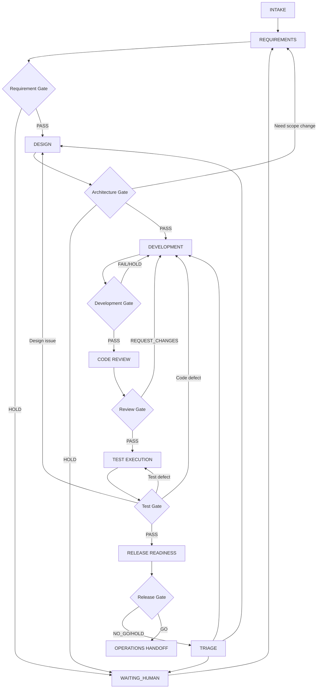

# Multi-Agent Production Gap Analysis

> 报告日期：2026-07-30  
> 主题：当前多 Agent 软件开发系统与真实生产环境之间的差距  
> 范围：角色划分、工作流、能力真实性、通信、上下文、成本、开发工程化能力。

## 1. 当前 Agent 划分是否符合真实软件团队

### 1.1 当前划分的合理性

当前系统包含：

```text
manager
requirement
architect
developer
review
test
release
```

这套划分基本符合真实软件团队的职责链路，但更像“把一个小团队的不同职责拆成多个 Agent”，而不是等同于真实组织架构。

| Agent | 真实团队中是否存在对应角色 | 是否必要 | 当前风险 | 建议 |
|---|---|---|---|---|
| `manager-agent` | 存在，对应项目经理/技术负责人/流程编排者 | 必要 | 如果过度依赖 LLM 决策，会成为单点误判 | 保持唯一入口，但把状态、Gate、审批交给确定性规则 |
| `requirement-agent` | 存在，对应产品经理/需求分析师 | 必要 | 只做“需求整理”不够，应承担澄清和验收标准质量 | 升级为 product-requirement-agent |
| `architect-agent` | 存在，对应架构师/技术负责人 | 中等必要 | 小项目中可能与 developer 重叠 | 小项目可作为 design mode，大项目保留独立 Agent |
| `developer-agent` | 存在，对应开发工程师 | 必要 | “生成代码”容易缺少工程执行闭环 | 强化 Git、依赖、环境、验证、commit |
| `review-agent` | 存在，对应 reviewer/security reviewer | 必要 | 与 test/security 容易重叠 | 与 test 合并为 quality-agent 或保留独立 review gate |
| `test-agent` | 存在，对应 QA/SDET | 必要 | 当前无 sandbox，执行风险较高 | 短期保留，第三周引入隔离执行 |
| `release-agent` | 存在，对应 release manager/SRE 交接 | 必要但边界要收缩 | 容易被误解为“部署 Agent” | 定位为发布前检查与运维交接，不直接部署 |

结论：当前 7 个 Agent 对“学习和验证多 Agent SDLC”是合理的；对单服务器、4GB 内存、API 调用模型的小团队生产使用则偏重，建议逐步收敛为 6 个常驻 Agent。

### 1.2 哪些 Agent 是必要的

最小可用生产闭环至少需要：

1. `manager-agent`：入口、状态、审批、调度、Gate。
2. `product/requirement`：需求澄清、范围、验收标准。
3. `developer`：代码实现、Git、工具验证。
4. `quality`：review、test、安全轻扫描。
5. `release/ops`：发布前检查、运维交接、回滚建议。

如果保持当前 7 Agent，也可以，但需要把 token 和状态管理成本纳入设计预算。

### 1.3 哪些 Agent 可能职责重叠

| 重叠区域 | 表现 | 风险 | 处理建议 |
|---|---|---|---|
| requirement vs architect | 架构阶段会发现需求不可行或范围冲突 | 两个 Agent 各自修改前提，导致事实分叉 | 架构只能提出反向问题，需求修改必须回到 requirement + 审批 |
| architect vs developer | 小项目中架构设计可能就是实现计划 | 过度文档化，拖慢交付 | 小任务允许跳过独立架构 Agent，使用 lightweight design gate |
| review vs test | review 检查测试代码，test 执行测试 | 结论可能重复或互相覆盖 | review 负责“质量判断”，test 负责“执行事实” |
| review vs security | review-agent 已包含安全审查 | 安全检查可能停留在 LLM 阅读 | 安全问题高风险时启用 security mode + 工具扫描 |
| release vs devops | release-agent 产出运维交接材料 | 被误当作可直接部署 | release-agent 不拿生产凭证，不直接改生产 |

### 1.4 是否存在缺失角色

| 可能缺失角色 | 是否建议立即新增 | 原因 |
|---|---|---|
| `security-agent` | 不立即常驻 | 先用 review/quality-agent + 工具扫描；认证、支付、隐私、供应链项目再独立 |
| `devops-agent` | 第四周按需引入 | 当前项目范围止于运维前交付；真实部署需要额外权限、凭证和回滚边界 |
| `database-agent` | 按需引入 | 只有涉及迁移、索引、兼容性和数据安全时才需要 |
| `documentation-agent` | 不常驻 | README、API 文档、release notes 可由 requirement/release 输出 |
| `product-agent` | 建议合并进 requirement | 需求不只是文字整理，还需要用户价值、范围和验收标准 |
| `ux-agent` | 可选 | 有复杂前端体验时启用，普通 CRUD 项目不常驻 |

## 2. 当前 Agent 工作流是否符合真实软件开发流程

### 2.1 当前线性流程

```text
需求分析
 ↓
架构设计
 ↓
代码开发
 ↓
代码审查
 ↓
测试
 ↓
发布
```

这个流程符合真实软件开发的主干，但不完整。真实生产流程会大量出现回路、阻断和人工决策，而不是单向流转。

### 2.2 必须增加或保留的回路

| 场景 | 推荐流转 |
|---|---|
| 需求不清晰 | requirement → WAITING_HUMAN → requirement |
| 架构发现需求冲突 | architect → requirement / WAITING_HUMAN |
| 架构代价过高 | architect → manager → 用户确认缩范围或接受代价 |
| review 失败 | review → developer rework → review |
| test 失败 | test → failure triage → developer/test/architect |
| release HOLD | release → manager Gate → 人工审批或回到对应阶段 |
| 工具缺失 | task BLOCKED → manager HOLD → 用户补环境或调整范围 |

### 2.3 release-agent 是否应该拥有最终否决权

release-agent 应该拥有强否决建议权，但不应单独拥有最终生产权力。

合理边界：

- release-agent 输出 `GO` / `NO_GO` / `HOLD`。
- manager-agent 按 ReleaseReadinessGate 重算结论。
- `NO_GO` 默认阻断。
- `HOLD` 可由明确人工审批覆盖，但必须记录风险接受。
- `GO` 只表示 `READY_FOR_OPERATIONS_HANDOFF`，不等于已部署。

这与真实生产环境类似：发布经理或 SRE 可以阻断发布，但生产发布最终还要受审批、变更窗口、权限和组织策略约束。

### 2.4 多 Agent 是否一定要参考人类团队流程

不一定。Agent 系统可以比人类团队更机械、更短、更自动化。人类团队中很多流程是为沟通、排期和责任边界服务的，Agent 不需要照搬会议、排期会、站会和长文档审批。

但以下生产不变量不能省：

1. 需求边界和验收标准。
2. 技术设计或至少实现计划。
3. 代码变更的真实 diff 和 commit。
4. 编译、测试、构建、安全扫描等真实工具证据。
5. 独立质量检查。
6. 失败回路。
7. 人工审批节点。
8. 发布前风险披露和回滚方案。

### 2.5 更合理的状态流转

推荐用下面的状态流替代单向瀑布：



## 3. Agent 能力真实性：是否过度依赖 LLM

### 3.1 LLM 适合做什么

| 任务 | LLM 适配度 | 说明 |
|---|---|---|
| 需求理解与澄清 | 高 | 适合提问、归纳、拆范围 |
| 验收标准草拟 | 高 | 但必须经过 Schema 和人工确认 |
| 架构方案生成 | 高 | 适合提出方案和风险，不适合独自证明可行 |
| 代码实现 | 中高 | 适合生成和修改代码，但必须由工具验证 |
| Code review | 中 | 适合语义审查，不能替代静态工具和测试 |
| 测试设计 | 高 | 适合设计测试矩阵和边界条件 |
| 测试结果解释 | 中 | 适合分析失败日志，但不能代替执行 |
| 发布总结 | 高 | 适合汇总证据和生成说明 |

### 3.2 必须由确定性工具完成的任务

| 任务 | 推荐执行者 |
|---|---|
| 编译检查 | Tool |
| 单元测试/集成测试执行 | Tool |
| 类型检查、lint、格式化 | Tool |
| Git branch/worktree/commit/diff/merge-base 校验 | Tool + Rule Engine |
| Docker build / 镜像扫描 | Tool |
| 依赖漏洞扫描 | Tool |
| Secret 扫描 | Tool |
| 部署命令 | Tool + 人工审批 |
| 状态迁移是否合法 | Rule Engine |
| Gate 是否通过 | Rule Engine |
| JSON 是否合规 | Runtime Guard / Ajv |

### 3.3 推荐职责分配

| 层 | 负责内容 | 不负责内容 |
|---|---|---|
| LLM Agent | 理解、规划、生成、归因、解释、总结 | 单独裁定测试/构建/安全是否成功 |
| Tool | 执行命令、读取文件、Git、测试、扫描、构建 | 解释业务意图 |
| Rule Engine | 状态迁移、Gate 聚合、审批阻断、Schema 校验 | 生成代码或需求 |
| Human | 范围取舍、风险接受、生产权限、不可逆操作 | 重复机械校验 |

## 4. Agent 通信方式是否合理

### 4.1 JSON Schema 的必要性

生产环境中，所有跨 Agent 的机器边界都应使用 JSON Schema：

- `task.json`
- `context-manifest.json`
- `result.json`
- `gate-result.json`
- `approval-request/response.json`
- `review-findings.json`
- `release-decision.json`
- `command-records.jsonl`
- `evidence.jsonl`

这些文件应该继续版本化。推荐所有 schema 包含：

```json
{
  "schema_version": 1,
  "workflow_id": "WF-...",
  "task_id": "TASK-...",
  "run_id": "RUN-...",
  "agent_id": "developer-agent"
}
```

### 4.2 不应全部 JSON 化

不是所有通信都需要 JSON。建议：

| 内容 | 格式 |
|---|---|
| 机器判定、状态、引用 | JSON / JSONL |
| 人类解释、报告、总结 | Markdown |
| 大型代码上下文 | 文件路径 + hash + diff |
| 运行日志 | 原始 stdout/stderr 文件 + CommandRecord |
| 长期知识 | RAG index / summary / task memory |

### 4.3 Agent 输出错误如何处理

推荐生产策略：

1. 立即用 Runtime Guard/Ajv 校验。
2. 首次失败只允许一次 JSON-only retry。
3. retry 只能修复格式，不得重写事实结论。
4. 第二次失败则任务 `BLOCKED` 或 workflow `HOLD`。
5. 错误写入 `json-validation-errors.jsonl`。

### 4.4 Agent 理解错误如何处理

理解错误不能靠 JSON Schema 发现，需要业务回路：

- requirement gate 检查验收标准是否可测。
- architecture traceability 检查 AC 是否映射到组件。
- development traceability 检查实现是否覆盖 AC。
- review-agent 检查实现和设计是否偏离。
- test-agent 检查 AC 是否有测试覆盖。
- manager-agent 在阶段结束生成面向用户的摘要，让用户能发现方向错误。

### 4.5 是否需要 Message Queue / Event Bus / API Gateway / Workflow Engine

对当前资源限制：

- **Message Queue**：不建议立即引入。单服务器本地工作流用 JSONL event log + OpenClaw sessions 足够。
- **Event Bus**：建议保留轻量事件链，必要时用 SQLite 建索引，不上 Kafka。
- **API Gateway**：如果有 Web UI 或外部系统调用再加；当前 CLI/本地工作流不必加。
- **Workflow Engine**：LangGraph 可以作为下一阶段的显式状态图，但必须服从 Runtime Guard、Schema 和审批协议。

结论：当前 LangGraph/OpenClaw 能力足够支撑中小项目原型；生产化重点不是换消息中间件，而是强化状态、证据、隔离和成本治理。

## 5. 上下文和 Token 成本差距

### 5.1 当前是否存在 token 浪费

存在，主要来自固定角色上下文、规则文件、工具说明、历史消息和重复传递的大型上下文。

已观察事实：

- manager-agent 首次简单冷启动对话约 `21.7k tokens`。
- manager workspace 文档和 rules 本身已有较大固定上下文。
- 多 Agent 每次切换都可能重复加载角色规则、任务上下文和前序总结。

### 5.2 manager-agent 是否需要知道所有历史

不需要。manager-agent 需要知道：

- 当前 workflow 状态。
- 当前 active tasks。
- 最新 `context-summary.md`。
- 未决审批。
- Gate 和 candidate commit。
- 关键风险与用户决策。

它不应该每次读取完整聊天历史、所有 Agent 原始报告和所有日志。原始材料应作为 evidence 存档，需要时按引用读取。

### 5.3 developer-agent 是否需要完整需求

通常不需要。developer-agent 需要：

- 与当前任务相关的 AC。
- 相关架构摘要和接口约束。
- 允许修改路径。
- 输入 commit。
- 目标文件和相邻代码。
- 测试/构建命令来源。

不需要完整用户聊天、全部需求讨论、所有 ADR 和全仓库文件。

### 5.4 review-agent 是否需要完整代码上下文

通常不需要。review-agent 应优先读取：

- candidate diff。
- 变更文件。
- 相关接口/依赖文件。
- 需求和架构摘要。
- 测试结果和命令日志。

只有当 diff 无法解释行为时，才扩展读取更多上下文。

### 5.5 优化方案

| 优化项 | 做法 | 效果 |
|---|---|---|
| Context 压缩 | 每阶段生成 `context-summary.md` | 避免重复加载完整历史 |
| Memory 分层 | workflow memory / task memory / project memory 分开 | 减少污染 |
| RAG | 对项目文件、历史报告、错误日志建立索引 | 按需检索 |
| Summary Agent | 可由小模型生成阶段摘要 | 降低大模型 token |
| Task Memory | 每个 task 只保留目标、约束、输入输出 | worker 不读 manager 私有历史 |
| Diff-first review | review 先看 diff，再扩上下文 | 降低审查成本 |
| Artifact references | 大文件以 hash + path 引用 | 避免 prompt 膨胀 |

## 6. 多 Agent 运行成本是否可接受

### 6.1 调用量估算

假设一次中小型项目：

```text
需求分析：10 轮
架构设计：5 轮
开发：50 次调用
Review：20 次调用
测试：30 次调用
```

worker 调用数：

```text
10 + 5 + 50 + 20 + 30 = 115 次
```

如果 manager 在每次派发、接收、Gate、总结时都调用 LLM，实际总调用数可能达到：

```text
160-250 次 LLM 调用
```

### 6.2 Token 估算

| 阶段 | 调用数 | 单次 token 粗估 | 阶段 token |
|---|---:|---:|---:|
| Requirement | 10 | 20k-30k | 200k-300k |
| Architecture | 5 | 25k-40k | 125k-200k |
| Development | 50 | 35k-70k | 1.75M-3.5M |
| Review | 20 | 40k-80k | 800k-1.6M |
| Test | 30 | 30k-60k | 900k-1.8M |
| Manager overhead | 45-120 | 10k-25k | 450k-3M |

总量级：

```text
当前未充分优化：5M-10M tokens / 项目
较好优化后：2M-4M tokens / 项目
强工具化和小模型路由后：1M-3M tokens / 项目
```

### 6.3 成本计算方式

由于当前仓库没有固定模型单价，建议报告成本时使用公式：

```text
成本 = input_M * P_input + output_M * P_output + cache_M * P_cache
```

如果按 7M input tokens、0.7M output tokens 估算：

| 示例单价 | 项目成本示例 |
|---|---:|
| 低价模型：input $1/M, output $3/M | 约 $9.1 |
| 中价模型：input $5/M, output $15/M | 约 $45.5 |
| 高价模型：input $15/M, output $75/M | 约 $157.5 |

这只是公式示例，不代表当前供应商报价。实际生产应读取模型供应商账单或本地用量日志。

### 6.4 降低成本的策略

1. 小模型处理摘要、JSON 修复、日志分类。
2. 大模型处理架构决策、复杂开发、疑难 bug。
3. manager 尽量确定性化，减少每步 LLM 调用。
4. review 采用 diff-first。
5. test 以工具执行为主，LLM 只分析失败。
6. 对重复 workspace 规则使用缓存。
7. 对长项目引入 RAG，不把全仓库塞给模型。

## 7. 代码开发能力差距

### 7.1 当前 Developer-Agent 的现实性

“根据需求生成代码”不等于真实开发。真实 developer-agent 应该是“具备工程纪律的自动开发者”。

当前系统已有正确基础：

- 本地 Git worktree。
- 真实 commit 要求。
- manager 校验 commit/diff/范围。
- 产出 development report、change manifest、traceability。

但生产环境还需要强化：

| 能力 | 当前阶段 | 生产要求 |
|---|---|---|
| Branch 策略 | 已有本地任务分支设计 | 标准命名、重做分支、integration 分支保护 |
| Commit 规范 | 已要求真实 commit | 需要 trailer、签名/作者、关联任务 |
| PR | 当前不做远程 Git | 生产可选接入 GitHub/GitLab PR |
| Code ownership | 尚弱 | 按路径限制 owner、审批人和禁止路径 |
| Dependency 管理 | 尚弱 | lockfile、许可证、漏洞、安装审批 |
| Environment 管理 | 尚弱 | devcontainer/Docker/sandbox、命令来源 |
| Merge conflict | 已要求不猜测 | 需要明确 rework/人工处理流程 |
| 测试闭环 | 部分 | 开发后至少执行最小验证，失败不提交或标风险 |

### 7.2 Developer-Agent 应增加的能力

1. 自动创建 branch/worktree。
2. 自动生成小步 commit。
3. 自动执行项目识别出的验证命令。
4. 自动维护 change-manifest。
5. 自动处理简单 merge conflict；复杂冲突 `HOLD`。
6. 自动打开本地 PR 描述或远程 PR 草稿。
7. 自动记录依赖变更和 lockfile。
8. 自动把实现映射到 AC。

### 7.3 必须避免的行为

- 未执行测试却声称“测试通过”。
- 看到测试失败后改测试来掩盖问题。
- 擅自删除用户代码。
- 擅自安装依赖或联网。
- 擅自修改全局 Git 配置。
- 大范围重写没有审批。
- 用 LLM 自述代替 commit/diff/日志证据。

## 8. 当前问题清单

按优先级排序：

| 优先级 | 问题 | 影响 |
|---|---|---|
| P0 | 无 sandbox 执行测试 | 不适合不可信代码 |
| P0 | LLM 与工具/规则边界不够清晰 | 容易产生假通过 |
| P0 | 上下文成本偏高 | 成本不可控 |
| P1 | LangGraph 定位尚未落地 | 状态流转仍依赖 manager 执行纪律 |
| P1 | 缺少真实部署/监控/回滚 | 不能称为上线闭环 |
| P1 | 安全能力分散 | 高风险项目不够可靠 |
| P2 | 文档和用户体验不足 | 难以商业化 |
| P2 | 多模型路由未系统化 | 简单任务浪费大模型 |

